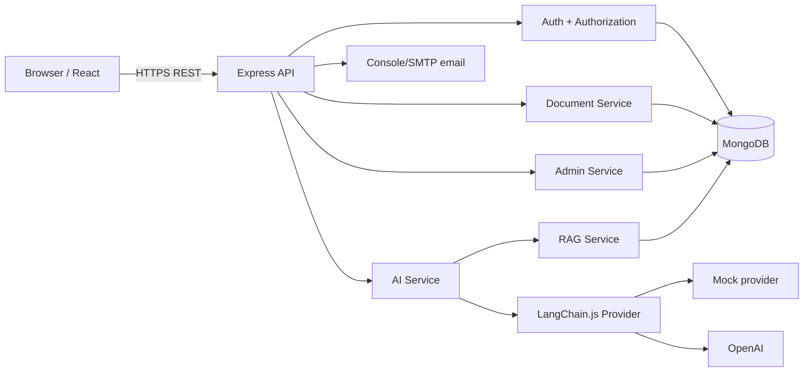
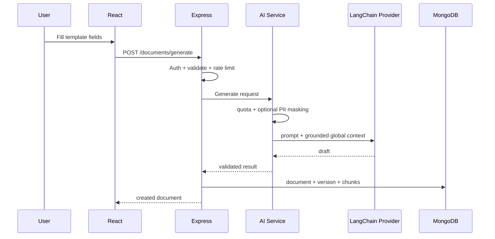
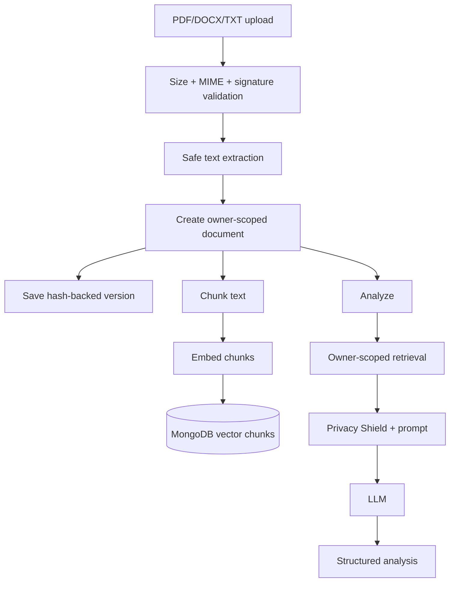
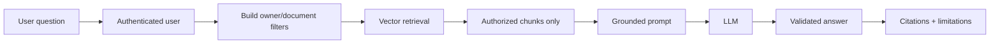

# Architecture

## 1. System overview



The frontend never calls the external LLM directly. Every AI request passes through authentication, authorization, rate limiting, quota checks, retrieval scoping and the AI service.

## 2. Backend layering

```text
Route
  -> authentication/authorization/rate-limit/validation middleware
  -> controller
  -> domain service
  -> model/repository operation
  -> safe response

Errors from all layers
  -> centralized error middleware
  -> safe client message + structured server log
```

Controllers coordinate HTTP behavior; reusable logic lives in services. This keeps AI, document, audit, token, mail, export and retrieval logic testable without bloated route files.

## 3. Data model

Principal collections:

- `users` — identity, role, verification and preferences
- `sessions` — refresh-session state/revocation
- `legaldocuments` — document metadata/current content
- `documentversions` — immutable saved revisions + SHA-256 hash
- `analysisresults` — structured AI analysis snapshots
- `vectorchunks` — chunk text, embedding and owner/source metadata
- `knowledgesources` — admin-managed shared knowledge metadata
- `conversations` — scoped chat history
- `auditlogs` — important security/product events
- `aiusages` — request/token/latency/success telemetry
- `sharelinks` — hashed random public-link tokens and expiry

## 4. Generation flow



## 5. Upload/analyze flow



Raw uploaded executable content is never run. The implementation extracts supported document text and persists the normalized document content rather than trusting filenames.

## 6. Private RAG flow



Security boundary: **authorization happens during retrieval, before context reaches the model**. The system does not retrieve every user's documents and ask the model to hide unauthorized data.

## 7. Frontend architecture

- `AuthContext` owns bootstrap/session state and theme preference.
- `lib/api.js` owns authenticated HTTP calls, in-memory access token and one-time refresh/retry behavior.
- `ProtectedRoute` gates authenticated/admin navigation as a UX control; backend authorization remains authoritative.
- `AppLayout` provides responsive dashboard navigation.
- Page components focus on workflow and call the API layer rather than embedding transport logic everywhere.

## 8. Scalability path

The included local vector mode is deliberately simple for demonstrations. The API contract and vector service also support MongoDB Atlas Vector Search so the retrieval implementation can scale without changing React or controller flows. Horizontal API scaling requires shared MongoDB session/audit state and normal stateless web hosting; access JWTs are self-contained while refresh state lives in MongoDB.
