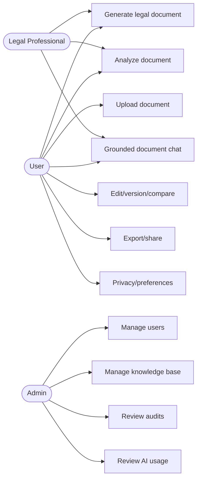
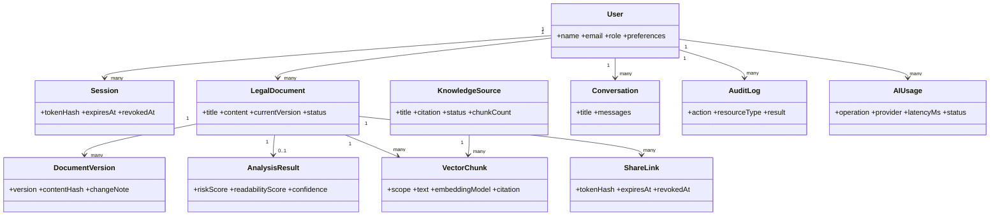
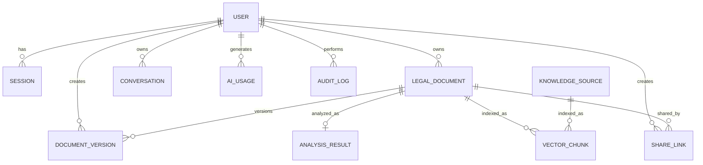
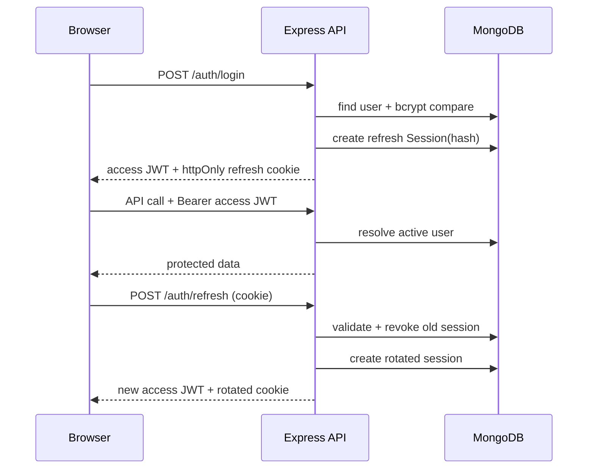
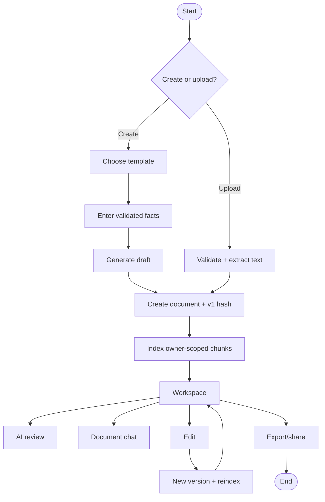
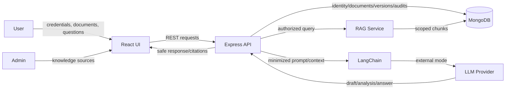
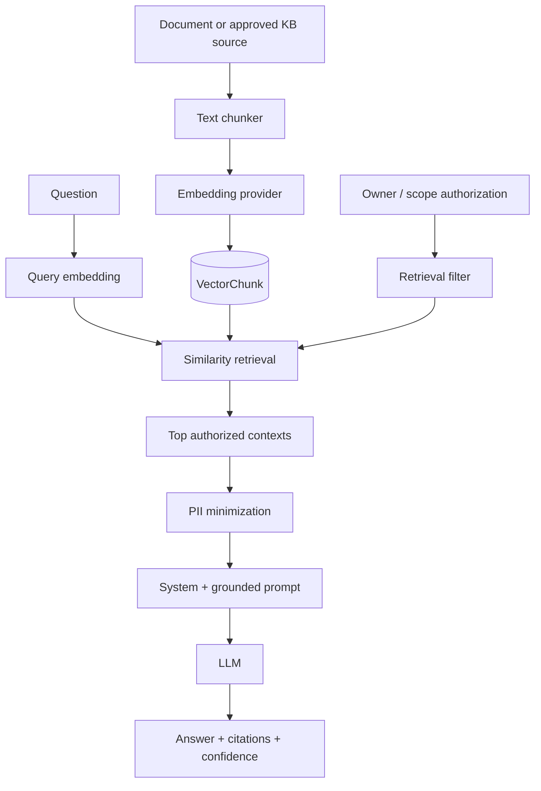
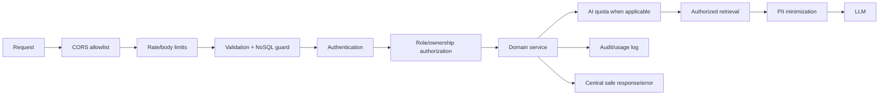

# B.Tech Project Diagrams

The diagrams use Mermaid so GitHub can render them directly and they can be recreated in draw.io/PlantUML for the final report.

## Use case diagram

## Component/class-level diagram

## ER diagram

## Authentication sequence

## Document activity flow

## Level-1 data flow diagram

## RAG / embedding pipeline

## Security control flow

